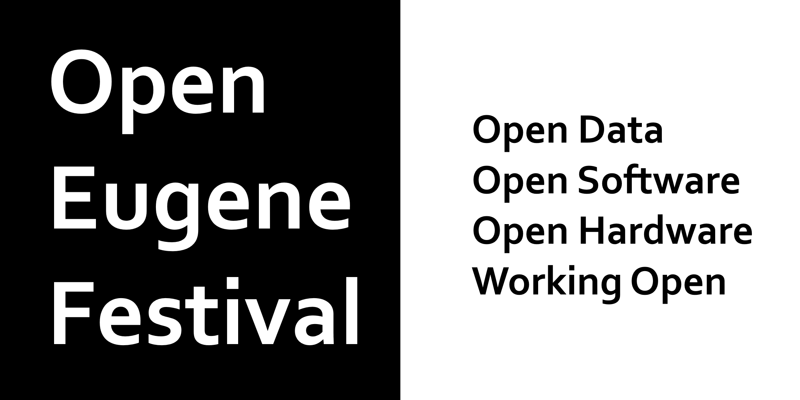

# What's an Open Festival? #

Part hack-a-thon, part conference, part art exhibition. We are working with learners & leaders to help citizens of Eugene open projects, improve collaboration, and inspire the community. [Here's a 5-minute explainer video](https://youtu.be/8VDYcNPw9zA) from [Mark Davis](https://github.com/nohorse)

### Working Open = Open Data :: Open Software :: Open Hardware :: Open Projects ###

Participants can learn from Mozilla Open Leaders the basics of running open projects.  Various local projects from teams at the University of Oregon (Open Data), Downtown Eugene artists (Open Hardware), Local Software Companies (Open Source Software)  will be “Working Open” through the weekend in hands-on workshops.   Bring your own projects and we’ll help you pick the right open source or creative commons license to help share your work with the world.  Bring your energy and we’ll help you collaborate.

## When & Where ##
Open Eugene Fest will be happening Friday November 30th and Saturday December 1st 2018.
Location is TBD but will definitely be downtown, Eugene.

## Submit a project ##
We are looking for projects that collaborators can work on during  the event.  Maybe you have a project that is up and running but not open-sourced.  We can help take you to the next level.  Perhaps you have an idea for a project and would like to start it out by working in the open.  We can get you started. Or maybe you have some data stuck in a flat file somewhere you;d like to see made available to the world or have a PI built.  That works too!  We'd love to build community connections between projects and contributors. 

[Fill in the project form here](https://goo.gl/forms/xQsoEPznuxRDdhNz2)

## Submit programming ##
Do you have a case study to talk about, or plans to provide open-data? Can teach a class on using github pages, or lead a workshop on inclusiveness. These are all examples of programming we'd love to make part of the event.

[Fill in the programming form here](https://goo.gl/forms/tg0Il8VadaCCdMSJ2)

## Signup as a Contributer, Volunteer, or Buy a Ticket ##
[get your ticket on eventbrite](https://www.eventbrite.com/e/open-eugene-festival-tickets-52110392587)

## Sponsor ##
[download the sponsorship details](open-eugene-fest-sponsorship.pdf)

